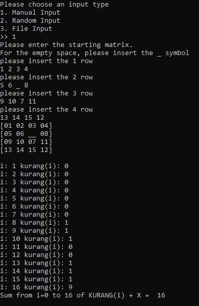
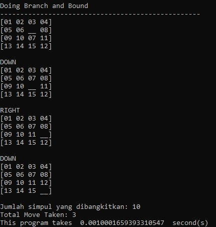
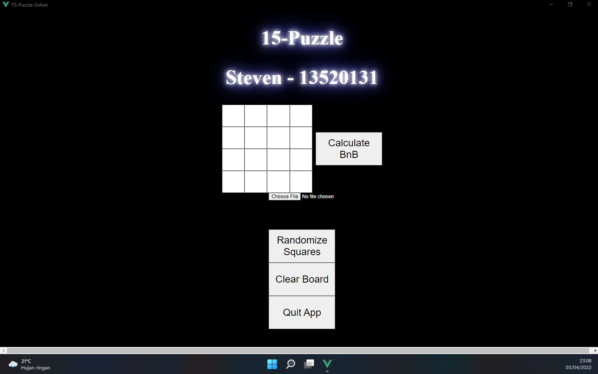
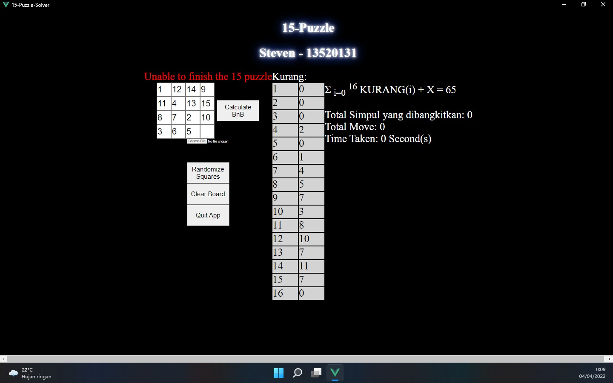

# Tugas Kecil 3 IF2211 Strategi Algoritma

> Membuat program untuk menyelesaikan persoalan 15-Puzzle dengan menggunakan Algoritma <em>Branch and Bound</em>. Nilai <em>bound</em> tiap simpul adalah penjumlahan cost yang diperlokan untuk sampai suatu simpul x dari akar, dengan taksiran <em>cost</em> simpul x untuk sampai ke <em>goal</em>. Taksiran cost yang digunakan adalah jumlah ubin tidak kosong yang tidak berada pada tempat sesuai susunan akhir (<em>goalstate</em>). Untuk semua instansiasi persoalan 15-puzzle, susunan akhir yang diinginkan terurut seperti berikut: <table> <tr align = "center"> <td>1</td> <td>2</td> <td>3</td> <td>4</td> </tr> <tr align = "center"> <td>5</td> <td>6</td> <td>7</td> <td>8</td> </tr> <tr align = "center"> <td>9</td> <td>10</td> <td>11</td> <td>12</td> </tr> <tr align = "center"> <td>13</td> <td>14</td> <td>15</td> <td></td> </tr> </table>

## Teknologi dan Library yang Digunakan

- Python 3.x
  - Eel
  - pip
- NPM
- Vue3.js
  - Babel
  - Vue CLI
  - Eslint
- HTML5
- CSS3
- JS

## Cara Memakai

### CLI

<strong><em>NOTE</em> : </strong>Untuk input manual dan input file, kotak kosong dilambangkan dengan "\_" (<em>underscore</em>)

1. Download/Clone Repository ini
2. Buka Terminal
3. Masuk ke directory src
4. Jalankan command
   ```bash
   py cli.py
   ```

### GUI

<strong><em>NOTE</em> : </strong>Gunakan <em>Google Chrome</em> sebagai default browser

<strong><em>NOTE</em> : </strong>Untuk input file, kotak kosong dilambangkan dengan "\_" (<em>underscore</em>)

1. Download/Clone Repository ini
2. Buka Windows Powershell
3. Masuk ke directory src
4. Buat virtual environtment apabila belum ada
   ```bash
   py -m venv venv
   ```
5. Masuk kedalam virtual environtment
   ```bash
   ./venv/Scripts/Activate.ps1
   ```
6. Install library Eel
   ```bash
   pip3 install eel
   ```
7. Jalankan command
   ```bash
   py app.py
   ```

## Tampilan CLI

### Tampilan Solvable Manual Input

<table>
   <tr>
      <td>  </td>
      <td>  </td>
   </tr>
</table>

### Tampilan Solvable File Input

<table>
   <tr>
      <td>  </td>
      <td>  </td>
   </tr>
</table>

### Tampilan Unsolvable


## Tampilan GUI

### Tampilan GUI Ketika Melakukan Solving


### Tampilan GUI



### Tampilan Awal Solvable Manual Input


### Tampilan Akhir Solvable Manual Input


### Tampilan Awal Solvable Input File


### Tampilan Akhir Solvable Input File


### Tampilan Unsolvable



## Ucapan Terima Kasih

Atas bimbingan dan kesempatannya, saya mengucapkan terima kasih kepada

- Dr. Masayu Leylia Khodra (Dosen K1 IF2211 Tahun 2021/2022)
- Dr. Nur Ulfa Maulidevi (Dosen K2 IF2211 Tahun 2021/2022)
- Dr. Rinaldi Munir (Dosen K3 IF2211 Tahun 2021/2022)
- Semua Asisten IF2211 Tahun 2021/2022

## Identitas Pembuat

<table>
   <tr align = "center">
      <td>Nama</td>
      <td>NIM</td>
      <td>Kelas</td>
   </tr>
   <tr align = "center">
      <td>Steven</td>
      <td>13520131</td>
      <td>K02</td>
   </tr>
</table>
